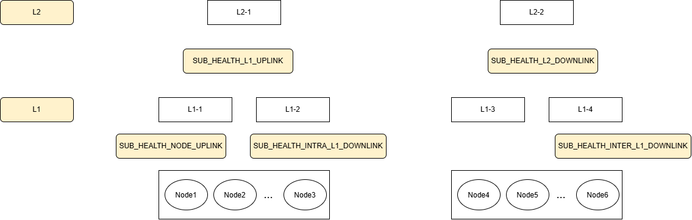

# 网络亚健康检测系统 (sub_health)

`subhealth` 是 `hikptool` 的一个子模块，用于检测UB CLOS 网络/ 电组网中节点间的通信时延异常，并通过聚类分析定位故障域。
系统采用**三阶段流水线**：

```
Step 1 探测规划        Step 2 探测执行          Step 3 亚健康检测
topology.json  ──▶  probe_plan.json  ──▶  probe_result.json  ──▶  detection.json
(拓扑)              (探测计划)             (探测结果/时延)          (检测结果/故障域)
```

当前支持以下五类故障域：



| 故障域                           | 含义                                                                                                                    |
| -------------------------------- | ----------------------------------------------------------------------------------------------------------------------- |
| `SUB_HEALTH_NODE_UPLINK`       | 所有从节点发出的探测数据均大于时间阈值。                                                                                |
| `SUB_HEALTH_L1_UPLINK`         | L1内正常数据和跨L1正常数据中位数，有明显差异。                                                                          |
| `SUB_HEALTH_L2_DOWNLINK`       | 在跨L1交换机的探测数据中，通过空间维度检测有异常值，若某一个L1下节点都是异常的，则认为是L2->L1链路存在亚健康。          |
| `SUB_HEALTH_INTRA_L1_DOWNLINK` | 本L1交换机内的L1->Node:L1到节点：在L1交换机内的这些探测数据中，通过空间维度检测有异常值。                               |
| `SUB_HEALTH_INTER_L1_DOWNLINK` | 对端L1交换机内的L1->Node:L1到节点：跨L1交换机的这些探测数据中，通过空间维度检测有异常值，对端L1交换机中有正常探测数据。 |

故障域在输出中对应以下字符串：

- `SUB_HEALTH_NODE_UPLINK`
- `SUB_HEALTH_L1_UPLINK`
- `SUB_HEALTH_L2_DOWNLINK`
- `SUB_HEALTH_INTRA_L1_DOWNLINK`
- `SUB_HEALTH_INTER_L1_DOWNLINK`

---

## 1. 工作原理简述

```
                    ┌─────────────────────────────┐
  topology.json ───▶│  Step 1 探测规划 (probe_plan)│  L1 冗余检测、发包数计算、
   (拓扑文件)       └─────────────┬───────────────┘  生成 intra/inter 目的Primary EID信息
                                  │ probe_plan.json
                    ┌─────────────▼───────────────┐
                    │  Step 2 探测执行 (probe_exec)│  本机节点作为源节点探测、多线程并发
                    └─────────────┬───────────────┘  urma_ping、Top-N 裁剪均值
                                  │ probe_result.json + urma_ping_output.log
                    ┌─────────────▼───────────────┐
                    │  Step 3 亚健康检测 (detect)  │  阈值 + K-means 聚类
                    └─────────────┬───────────────┘  五类故障域判定
                                  │
                          detection.json + sub_health_detect.log
```

## 2. 当前版本限制

使用前请注意以下限制：

1. 当前仅支持指定UBPU Primary EID 的探测，无法指定UB Port EID。
2. Step 2 只执行属于本机节点的探测任务，不会在一台服务器上完成整个网络所有节点的探测。
3. 完全超时、命令执行失败或输出格式异常的探测任务不会写入时延数组。
4. 当前版本没有独立的 `LINK_DOWN` 故障域。
5. `detection.json` 为 `{}` 仅表示在有效时延样本中未检测到亚健康，不能单独证明网络完全健康。
6. 输出文件名固定，当前不支持通过命令行自定义输出文件名。
7. 输出文件写入当前工作目录，已有同名文件会被覆盖。

## 3. 环境要求

### 3.1 硬件环境

真实探测需要支持 URMA 通信的鲲鹏 ARM64 服务器。

其他架构可以用于源码检查、编译验证或算法测试，但不能保证能够完成真实的 `urma_ping` 探测。

### 3.2 操作系统

推荐使用 openEuler。

其他 Linux 发行版需要满足 hikptool、URMA 和相关运行依赖。

### 3.3 构建依赖

- C 编译器
- CMake 3.13 或更高版本
- Make 或其他 CMake 支持的构建工具
- pthread
- 系统数学库

cJSON 源码已经包含在本模块中，不需要额外安装系统 `libcjson` 软件包。

### 3.4 运行依赖

- `urma_ping`：执行真实 UB 时延探测
- `ip`：通过 `ip addr` 获取本机 IP
- `curl`：通过 RESTCONF 接口获取拓扑和 slot 信息
- RESTCONF Unix Socket：`/run/ubm/socket/ubm_nuds/restconf.sock`

使用 root 权限运行，以保证能够访问 RESTCONF Socket 和 URMA 设备。

## 4. 编译程序

### 4.1 获取源码

```bash
git clone https://atomgit.com/openeuler/hikptool.git
cd hikptool
```

### 4.2 配置项目

```bash
cmake -S . -B build
```

如果使用较新的 CMake 时出现以下兼容性错误：

```text
Compatibility with CMake < 3.5 has been removed
```

可以增加兼容参数：

```bash
cmake -S . -B build \
  -DCMAKE_POLICY_VERSION_MINIMUM=3.5
```

### 4.3 编译项目

```bash
cmake --build build -j"$(nproc)"
```

编译完成后，可执行文件位于：

```text
build/hikptool
```

### 4.4 配置运行环境变量

运行 `hikptool` 前，需要将 `libhikptdev` 动态库所在目录加入
`LD_LIBRARY_PATH`。

在源码目录下执行：

```bash
HIKP_LIB_DIR="$(realpath ../build/libhikptdev/src/rciep)"
export LD_LIBRARY_PATH="${HIKP_LIB_DIR}${LD_LIBRARY_PATH:+:${LD_LIBRARY_PATH}}"
```

## 5. 目录结构

```
hikptool/ub/subhealth/
├── README.md                  # 本文件（使用说明）
├── sub_health.h               # 头文件：数据结构、常量、模块接口
├── sub_health_cmd.c           # 命令入口、参数解析、流程编排
├── topology_generator.c       # 拓扑生成（RESTCONF XML → JSON，仅电组网）
├── probe_plan.c               # 探测规划（L1 冗余检测、发包数计算、目的端口匹配）
├── probe_execute.c            # 探测执行（多线程 urma_ping、Top-N 裁剪均值）
├── sub_health_detect.c        # 亚健康检测（阈值 + 聚类、五类故障域判定）
├── unified_clustering.h       # 聚类算法接口
├── unified_clustering.c       # 统一聚类算法（Z-score + 肘部法 + K-means++）
├── cJSON.h / cJSON.c          # 内嵌 JSON 解析库
```

## 6. 全流程执行

### 6.1 电组网自动获取拓扑

电组网全流程允许不指定任何输入文件，程序通过 RESTCONF 自动生成拓扑：

```bash
./hikptool sub_health
```

该模式仅适用于支持 RESTCONF 自动拓扑的电组网。

### 6.2 手动指定拓扑

Clos 组网以及需要手动提供拓扑的场景，通过 `-t` 指定输入文件：

```bash
./hikptool sub_health -t topology.json
```

输入文件支持相对路径和绝对路径，例如：

```bash
./hikptool sub_health -t /data/sub_health/topology.json
```

完成后当前目录会生成：

| 文件                      | 说明                                             |
| ------------------------- | ------------------------------------------------ |
| `probe_plan.json`       | 探测计划（Step 1 输出）                          |
| `probe_result.json`     | 探测结果（Step 2 输出，含各目的端口时延）        |
| `urma_ping_output.log`  | 每次 urma_ping 的完整原始输出日志（Step 2）      |
| `sub_health_detect.log` | 检测诊断日志（Step 3，每个 UBPU 的完整分析过程） |
| `detection.json`        | 结构化检测结果（Step 3 输出，故障域列表）        |

## 7. 分步执行

分步执行，可以用 `-1 / -2 / -3` 只执行某一步：

```bash
# 第 1 步：探测规划（输入拓扑，输出探测计划）
./hikptool sub_health -1 -t topology.json 
# 第 2 步：探测执行（输入探测计划，输出探测结果；本机节点执行 urma_ping）
./hikptool sub_health -2 -p probe_plan.json
# 第 3 步：亚健康检测（输入探测结果，输出检测结果）
./hikptool sub_health -3 -r probe_result.json
```

每个独立步骤都必须显式指定自己的输入文件。Step 1 只接受 `-1` `-t`，
Step 2 只接受 `-2``-p`，Step 3 只接受 `-3` `-r`；传入其他步骤的输入选项会报错并显示正确用法。

## 8. 参数说明

```
hikptool sub_health [选项]
```

| 选项   | 长选项               | 说明                                                           |
| ------ | -------------------- | -------------------------------------------------------------- |
| `-h` | `--help`           | 显示帮助                                                       |
| `-t` | `--topology`       | 拓扑输入文件（Step 1 必需，全流程可选）                        |
| `-p` | `--probe-plan`     | 探测计划输入文件（Step 2 必须指定）                            |
| `-r` | `--result`         | 探测结果输入文件（Step 3 必须指定）                            |
| `-k` | `--coverage`       | 链路覆盖次数，默认 5，范围 [3, 20]整数；仅 Step 1 和全流程可用 |
| `-s` | `--packet-size`    | 探测包大小（字节），默认 4096，范围 [4, 4096]的整数            |
| `-T` | `--time-threshold` | 时延阈值 ms，默认 100，参数范围为正整数，超过即标记异常        |
| `-1` | `--step1`          | 只执行探测规划                                                 |
| `-2` | `--step2`          | 只执行探测执行                                                 |
| `-3` | `--step3`          | 只执行亚健康检测                                               |

## 9. 拓扑文件

拓扑文件是独立 Step 1 的必需输入；全流程未指定 `-t` 时仅在电组网下通过
RESTCONF 自动生成。手动拓扑格式如下（`topology.json`）：

```json
{
  "l2_switches": [
    "L2-SW01",
    "L2-SW02"
  ],
  "l1_switches": {
    "L1-SW01": {
      "192.168.1.1": {
        "0": "0000:0000:0000:0000:0000:0000:0000:0001",
        "1": "0000:0000:0000:0000:0000:0000:0000:0005"
      },
      "192.168.1.2": {
        "0": "0000:0000:0000:0000:0000:0000:0000:0002",
        "1": "0000:0000:0000:0000:0000:0000:0000:0006"
      },
      "192.168.1.3": {
        "0": "0000:0000:0000:0000:0000:0000:0000:0003",
        "1": "0000:0000:0000:0000:0000:0000:0000:0007"
      },
      "192.168.1.4": {
        "0": "0000:0000:0000:0000:0000:0000:0000:0004",
        "1": "0000:0000:0000:0000:0000:0000:0000:0008"
      }
    },
    "L1-SW02":{
      "192.168.2.1": {
        "0": "0000:0000:0000:0000:0000:0000:0000:0011",
        "1": "0000:0000:0000:0000:0000:0000:0000:0015"
      },
      "192.168.2.2": {
        "0": "0000:0000:0000:0000:0000:0000:0000:0012",
        "1": "0000:0000:0000:0000:0000:0000:0000:0016"
      },
      "192.168.2.3": {
        "0": "0000:0000:0000:0000:0000:0000:0000:0013",
        "1": "0000:0000:0000:0000:0000:0000:0000:0017"
      },
      "192.168.2.4": {
        "0": "0000:0000:0000:0000:0000:0000:0000:0014",
        "1": "0000:0000:0000:0000:0000:0000:0000:0018"
      }
    }
  }
}
```

结构说明：

| JSON 路径                                     | 必填 | 说明                                       |
| --------------------------------------------- | ---- | ------------------------------------------ |
| `l2_switches`                               | 是   | L2 交换机名称数组；电组网填写空数组 `[]` |
| `l1_switches`                               | 是   | L1 交换机和节点的映射对象                  |
| `l1_switches.<L1_NAME>`                     | 是   | 指定 L1 下的节点集合                       |
| `l1_switches.<L1_NAME>.<NODE_IP>`           | 是   | 节点 IPv4 地址，必须是合法 IPv4            |
| `l1_switches.<L1_NAME>.<NODE_IP>.<UBPU_ID>` | 是   | UBPU 到Primary EID 的映射                 |
| UBPU 对应的值                                 | 是   | 对应 UBPU 的 Primary EID                   |

> 电组网拓扑：L1 名固定为 `1D-FULLMESSH`，`l2_switches` 为空。
> 拓扑中每个 UBPU 对应的 Primary EID，会在探测计划和结果中透传为 src_eid。

## 10. 查看检测结果

### 10.1 `detection.json`

```json
{
  "192.168.1.1": {
    "0": {
      "src_eid": "0000:0000:0000:0000:0000:0000:0000:0001",
      "sub_health_dst_eids": ["0000:0000:0000:0000:0000:0000:0000:0002", "0000:0000:0000:0000:0000:0000:0000:0003","0000:0000:0000:0000:0000:0000:0000:0004"],
      "sub_health_latencies": [3.366, 2.534, 3.586],
      "sub_health_domain": ["SUB_HEALTH_INTRA_L1_DOWNLINK"]
    },
    "1": {
      "src_eid": "0000:0000:0000:0000:0000:0000:0000:0005",
      "sub_health_dst_eids": ["0000:0000:0000:0000:0000:0000:0000:0006", "0000:0000:0000:0000:0000:0000:0000:0007","0000:0000:0000:0000:0000:0000:0000:0008"],
      "sub_health_latencies": [5.16, 3.853, 4.38433],
      "sub_health_domain": ["SUB_HEALTH_INTRA_L1_DOWNLINK"]
    }
  }
}
```

字段说明：

| 字段                     | 说明                                            |
| ------------------------ | ----------------------------------------------- |
| `src_eid`              | 当前节点当前 UBPU 的源 Primary EID              |
| `sub_health_dst_eids`  | 被标记为异常的目的 Primary EID 数组             |
| `sub_health_latencies` | 异常目的 Primary EID 对应的时延数组，单位为毫秒 |
| `sub_health_domain`    | 当前 UBPU 命中的故障域数组                      |

`sub_health_dst_eids` 和 `sub_health_latencies` 按相同索引一一对应。

异常链路按照以下顺序写入：

1. intra 异常链路
2. inter 异常链路

只有检测到异常的节点和 UBPU 才会写入 `detection.json`。

### 10.2 空检测结果

下面的结果：

```json
{}
```

表示程序没有在当前有效时延样本中检测到符合规则的亚健康故障域。

它不等同于“网络一定健康”，因为以下探测任务不会写入 `probe_result.json` 的时延数组：

- 所有请求均超时
- `urma_ping` 命令不存在或执行失败
- 输出数量不符合预期
- 成功样本数少于 `coverage_k`
- 本机节点没有对应的探测任务

遇到空结果时，应依次检查：

1. Step 2 终端汇总中的 `ok/timeout/failed` 数量。
2. `probe_result.json` 是否包含本机节点和有效时延。
3. `urma_ping_output.log` 中具体链路的 `Status`。
4. 是否存在大量完全超时、执行失败或成功样本不足。

确认探测数据有效后，再考虑调整 `-T` 或增加 `-k`。

### 10.3 Step 2 探测结果

Step 2 完成后，会在终端输出任务汇总：

```text
[INFO] Probe execution summary: total=10, ok=8, timeout=1, failed=1.
```

字段说明：

| 字段        | 说明                                               |
| ----------- | -------------------------------------------------- |
| `total`   | 本机执行的探测任务总数                             |
| `ok`      | 命令执行成功且有效样本数充足的任务数               |
| `timeout` | 所有探测请求均明确超时的任务数                     |
| `failed`  | 命令、配置、输出解析或有效样本数不符合要求的任务数 |

#### `probe_result.json`

`probe_result.json` 只写入状态为 `ok` 的探测链路及其时延：

```json
{
  "intra_l1_dst_eids": [
    "0000:0000:0000:0000:0000:0000:0000:0002"
  ],
  "intra_l1_latencies": [
    1.253
  ]
}
```

目的 EID 和时延数组按相同索引一一对应。

状态为 `timeout` 或 `fail` 的链路不会写入时延数组。因此，某条链路没有出现在 `probe_result.json` 中，并不能直接判断它是完全超时还是执行失败，需要继续检查 `urma_ping_output.log`。

#### Step 2 整体超时

Step 2 设置了固定的 180 秒整体执行超时。该时间限制覆盖本机节点的全部探测任务及 `probe_result.json` 的生成过程，并不是单次 `urma_ping` 的超时时间。
如果 Step 2 在 180 秒内没有完成，程序会输出：

```text
[ERROR] Probe execution watchdog timed out after 180 seconds.
```

### 10.4 `sub_health_detect.log`

`sub_health_detect.log` 记录每个节点和 UBPU 的详细检测过程，包括：

- 时间阈值判断
- intra/inter 聚类结果
- 中位数计算和比较
- 连续异常位置检查
- L1 映射检查
- 最终故障域判断
- 异常目的 EID 和时延

需要分析“为什么被判定为某个故障域”时，应优先查看该日志。

### 10.5 `urma_ping_output.log`

`urma_ping_output.log` 记录每个探测任务的源 EID、目的 EID、执行状态、样本数量、命令退出码和原始输出。

日志示例：

```text
========== urma_ping begin ==========
task_id: 0
src_eid: 0000:0000:0000:0000:0000:0000:0000:0001
dst_eid: 0000:0000:0000:0000:0000:0000:0000:0002
packet_size: 4096
packet_count: 10
required_samples: 5
Status: ok
success_count: 10
request_timeout_count: 0
exit_code: 0
cmd: urma_ping ...
-------------------------------------
...
========== urma_ping end ============
```

主要字段说明：

| 字段                                                                                                                   | 说明                                                |
| ---------------------------------------------------------------------------------------------------------------------- | --------------------------------------------------- |
| `src_eid`                                                                                                            | 探测源 EID                                          |
| `dst_eid`                                                                                                            | 探测目的 EID                                        |
| `Status: ok`                                                                                                         | 命令执行成功且有效样本数不少于 `required_samples` |
| `Status: timeout`                                                                                                    | 所有探测请求均明确输出 `Request timeout`          |
| `Status: fail`                                                                                                       | urma_ping执行失败                                   |
| `success_count`                                                                                                      | 成功获得时延的样本数量                              |
| `request_timeout_count`                                                                                              | 明确超时的请求数量                                  |
| `exit_code`                                                                                                          | `urma_ping` 命令退出码                            |
| 部分请求超时时，如果输出数量完整、命令执行成功，并且有效样本数不少于 `required_samples`，任务仍可能被标记为 `ok`。 |                                                     |
| 输出中的：                                                                                                             |                                                     |

- `Status: ok` 表示探测成功；
- `Status: timeout` 表示完全超时；
- `Status: fail` 表示执行失败。

## 11. 参数与算法速查

| 参数               | 默认值 | 说明                                                                                                  |
| ------------------ | ------ | ----------------------------------------------------------------------------------------------------- |
| `coverage_k`     | 5      | 链路覆盖次数；由 Step 1/全流程指定并写入探测计划；电组网 intra 发包数 = k，CLOS intra 发包数 = k × 2 |
| `packet_size`    | 4096   | urma_ping 的 `-s` 参数                                                                              |
| `time_threshold` | 100ms  | 时延超过此值标记为潜在异常                                                                            |

- Step 2 时延处理：每个探测对多次 ping，只保留命令执行成功、输出数量符合预期且成功样本数不少于 coverage_k 的探测对；允许部分请求超时
- Step 3 异常标记为 **OR 逻辑**：`时延 > 阈值` 或 `聚类判为异常`，任一满足即异常
- 聚类算法：Z-score 标准化 → 肘部法选 K → K-means++ → 均值比 > 2.0 判为异常 → 递归细化

## 12. 常见问题

**Q: 电组网运行报错 "Failed to generate topology"？**
RESTCONF 服务不可用。确认 `/run/ubm/socket/ubm_nuds/restconf.sock` 存在；或改用 `-t topology.json` 手动指定拓扑。

**Q: 没有 `urma_ping` 时探测结果会怎样？**
Step 2 执行 `urma_ping <dst> -I <src> -s <size> -c <count>`。命令不存在时，探测任务会被判定为执行失败并从结果数组中过滤，`probe_result.json` 的时延数组为空，Step 3 检不出异常。请先安装 `urma_ping` 并加入 PATH。

### Q：detection.json 是空对象

先检查 `probe_result.json` 是否存在有效时延，再检查 `urma_ping_output.log`。

重点关注：

- 命令执行失败
- 完全超时
- 输出数量异常
- 成功样本不足
- 本机节点没有探测任务

确认探测数据有效后，才考虑适当降低 `-T` 或增加 `-k`。

### Q：能否指定输出路径

当前版本不支持。

以下文件名固定：

```text
probe_plan.json
probe_result.json
detection.json
urma_ping_output.log
sub_health_detect.log
```

### Q: detection.json 里没有异常，但网络感觉有问题。

把 `-T` 阈值调小（如 `-T 10`），或调大 `-k` 覆盖次数增加采样。
